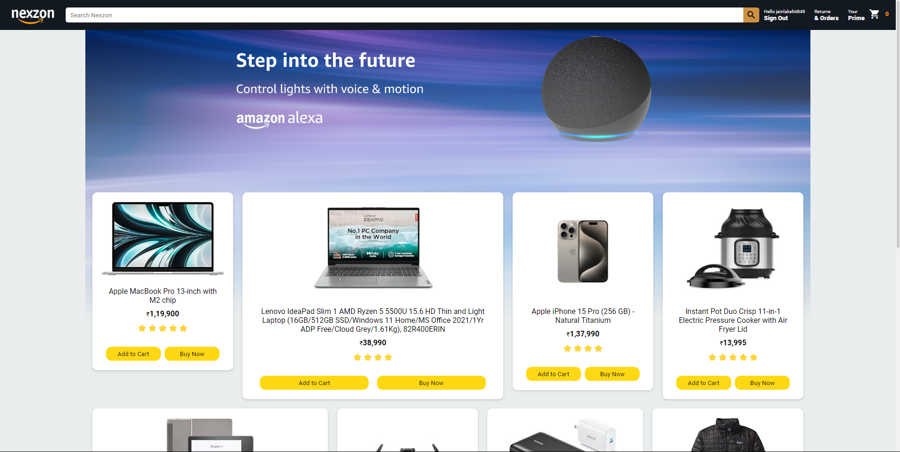
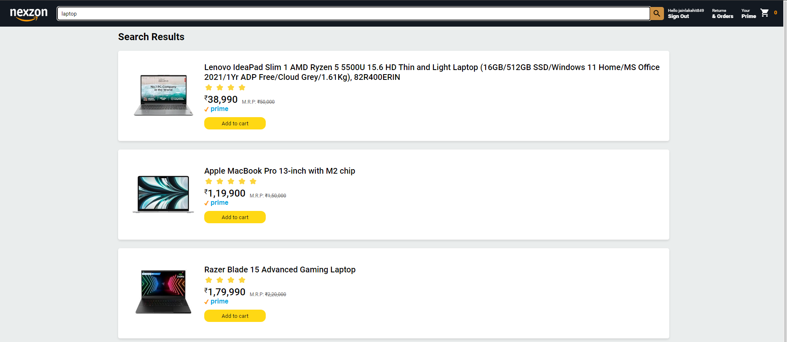
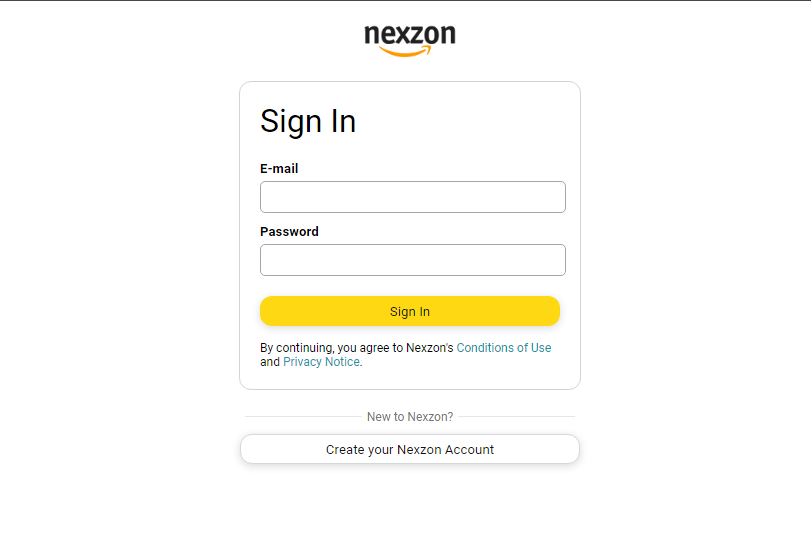
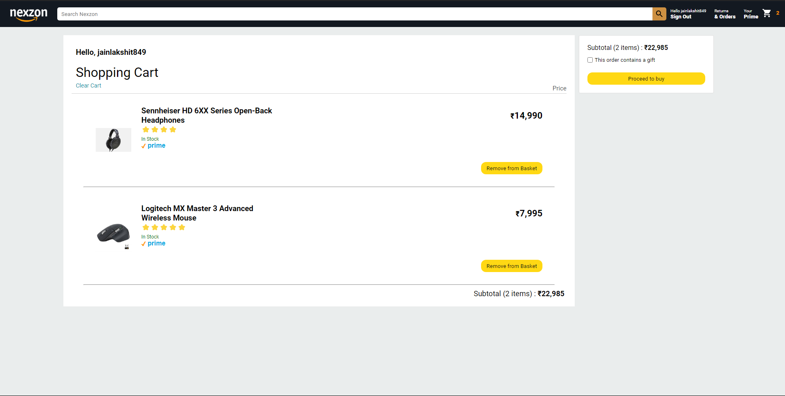
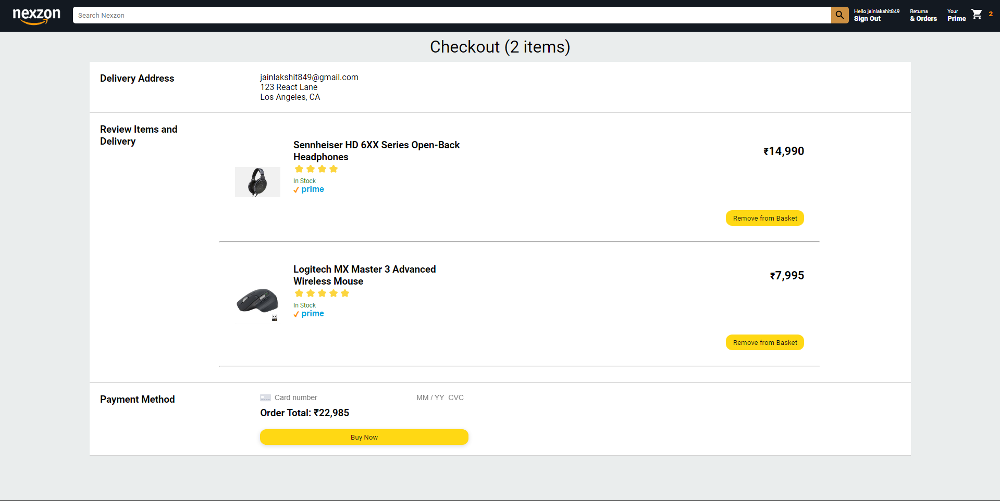
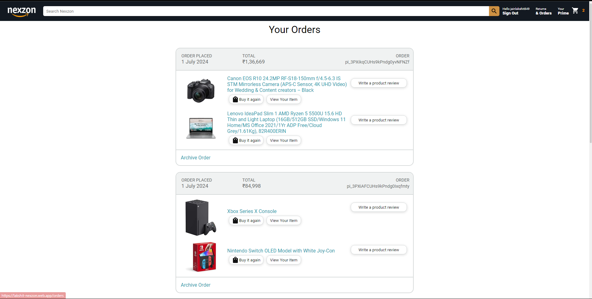

# Nexzon : An Amazon Clone

Nexzon is a functional e-commerce website built with React, designed to mimic the core functionalities of Amazon. This project showcases my ability to create a user-centric shopping experience. Customers can browse a wide variety of products, securely complete purchases using integrated payment gateways, and manage their shopping carts. The chosen dependencies, like Material UI and Stripe, demonstrate my commitment to building a user-friendly and secure platform, replicating the essential features of a modern e-commerce website.

## Project is Live at : https://lakshit-nexzon.web.app/

## Table of Contents

- [Preview](#preview)
- [Key Features](#key-features)
- [Technologies Used](#technologies-used)
- [Technical Implementation](#technical-implementation)
- [Dependencies](#dependencies)
- [Explore the Code](#explore-the-code)
- [Contact](#contact)

## Preview

**This is the Home Page**

**Search Results**

**Sign In Page**

**Cart Page**

**Payment/Checkout Page**

**Orders Page**

## Key Features

- **Product Listing**:
  - The platform displays a wide range of products for customers to explore.
  - Products are categorized and organized for easy navigation and search.
- **Product Details**:
  - Customers can view detailed information about each product, including images, descriptions, and prices.
  - Product details are presented in an intuitive and engaging layout.
- **Shopping Cart**:
  - Users can add products to their shopping cart for purchase.
  - The shopping cart displays the selected products, quantities, and total prices.
- **Checkout Process**:
  - Customers can securely complete purchases using integrated payment gateways.
  - The checkout process includes entering shipping information and payment details.
- **Order History**
  - Users can view their order history and track the status of their purchases.
  - Order details include product information, prices, and delivery status.
- **User Authentication**
  - The platform supports user authentication and authorization.
  - Users can create accounts, log in, and securely access their profiles.
- **Responsive Design**
  - The website is designed to be responsive and accessible on various devices.
  - The layout adjusts to different screen sizes for optimal viewing experience.
- **Search Functionality**
  - Customers can search for products using keywords and filters.
  - The search functionality provides relevant results and suggestions.
- **Payment Gateway**
  - Integrated Stripe payment gateway for secure and seamless transactions.
  - Customers can pay using credit cards or other payment methods.

## Technologies Used

- **Frontend**: HTML, CSS, JavaScript, React
- **Frontend**: React
- **Backend**: Node.js,firebase
- **Database**: Firestore
- **Payment Gateway**: Stripe
- **UI Framework**: Material UI
- **Deployment**: Firebase Hosting

## Technical Implementation

- **React Components:**
  - The project is structured using React components to create a modular and reusable design.
  - Components are organized into a logical hierarchy for maintainability and scalability.
- **State Management:**
  - The application state is managed using React hooks and context API.
  - State variables are updated and shared across components to maintain consistency.
- **Routing:**
  - React Router is used for client-side routing to navigate between pages.
  - Routes are defined to handle different URLs and render corresponding components.
- **Authentication:**
  - Firebase Authentication is implemented for user sign-up and login.
  - Users can create accounts, log in, and access personalized features.
- **Database:**
  - Firestore is used as a NoSQL database to store product and user information.
  - Data is organized into collections and documents for efficient querying and retrieval.
- **Payment Processing:**
  - Stripe is integrated for secure payment processing and transactions.
  - Customers can enter payment details and complete purchases with confidence.
- **Responsive Design:**
  - The website layout is designed to be responsive and mobile-friendly.
  - CSS media queries are used to adjust styles based on screen sizes.
- **Deployment:**
  - The application is deployed on Firebase Hosting for public access.
  - Hosting configurations are managed through the Firebase console.
- **Material UI:**
  - Material UI components are used for styling and theming the application.
  - Pre-built components and styles are leveraged for consistent design.

## Dependencies

- `@emotion/react`
- `@emotion/styled`
- `@mui/icons-material`
- `@mui/material`
- `@stripe/react-stripe-js`
- `@stripe/stripe-js`
- `axios`
- `firebase`
- `moment`
- `react`
- `react-currency-format`
- `react-dom`
- `react-router-dom`

## Explore the Code

Github Repository : https://github.com/lakshitcodes/nexzon

## Contact

LinkedIn Profile: https://www.linkedin.com/in/jainlakshit/
Thank you for visiting my Airbnb clone project. I hope you find the functionalities and implementation impressive. Feel free to explore the platform and reach out if you have any questions or feedback.
